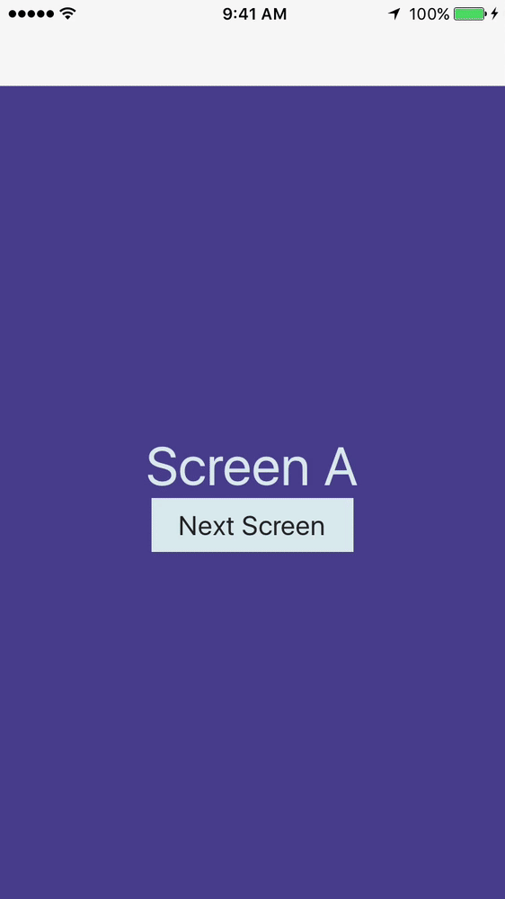

# react-navigation-transitions

### Installation
`npm install react-navigation-transitions --save`

### Instructions
These functions are meant to be used as the `transitionConfig` with [react-navigation](https://reactnavigation.org/). So far it includes the following transitions:

`fromLeft`

`fromTop`

`fadeIn`

`zoomIn`

`zoomOut`

`flipY`

`flipX`

More will be added in future versions.

### Example

```javascript
import { createStackNavigator } from 'react-navigation';
import { fromLeft } from 'react-navigation-transitions';

const appStack = createStackNavigator(
  {
    ScreenA: {
      screen: ScreenA,
    },
    ScreenB: {
      screen: ScreenB,
    },
  },
  {
    initialRouteName: 'ScreenA',
    transitionConfig: () => fromLeft(),
  },
);
```

The default duration is 300 milliseconds but you can pass is a custom transition duration like so:

```javascript
transitionConfig: () => fromLeft(1000),
```

## GIFS

### fromLeft


### fromTop


### fadeIn


### zoomIn


### zoomOut



### flipY


### flipX


The basis for these functions can be found in the `react-navigation` docs [here](https://reactnavigation.org/docs/stack-navigator.html#modal-stacknavigator-with-custom-screen-transitions).
